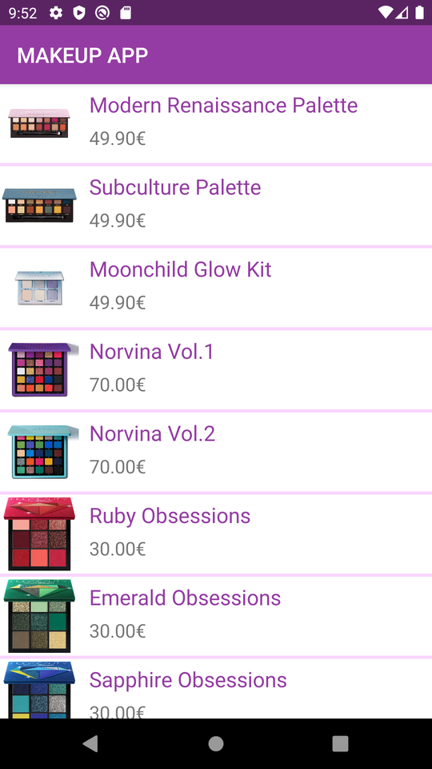
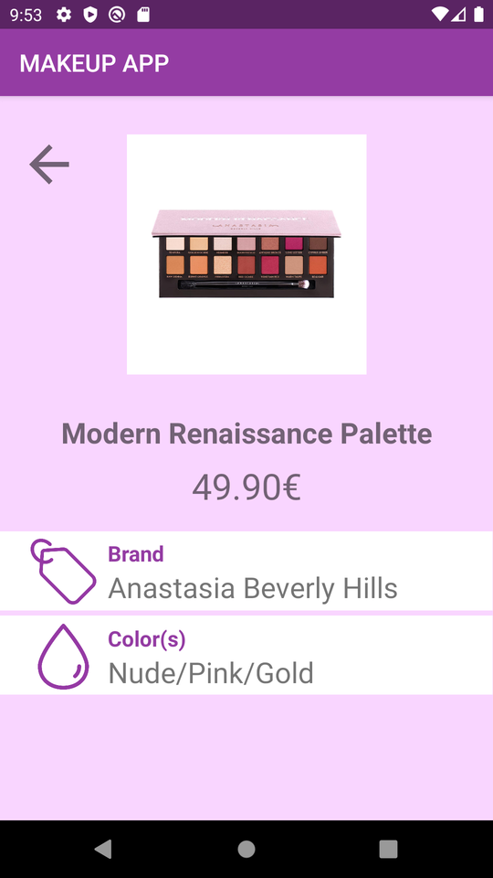

<div align="center">
<h1>Application Makeup</h1>
<h2>Sawsane Hafsati</h2>
</div>
<br>

# Présentation du projet
Ce projet est une application Android permettant d'afficher une liste de produits de maquillage ainsi que les détails de chaque produit grâce à l'utilisation d'une API Rest.

Il m'a permis de comprendre de nombreux aspects de la programmation Android ainsi que certaines notions plus poussées en programmation Java.

# Tester l'application
## Pré-requis
- Avoir installé Android Studio 
- Avoir un émulateur Android fonctionnel

## Récupérer le projet et le lancer
- Cloner la branche master du répertoire à l'aide de la commande suivante :
```
git clone https://github.com/SawsaneHafsati/MyApp.git
```
- Il suffit ensuite d'ouvrir le projet sur Android Studio

# Consignes respectées
- Écran avec une liste d'éléments
- Écran avec le détail d'un élément
- Appel WebService à une API Rest
- Stockage de données en cache

# Les plus de l'application 
- Architecture MVC 
- Travail sur le design
- Principes SOLID respectés au maximum
- Utilisation d'un patron de conception (*Adapter*)
- Utilisation de singletons (principe d'injection de dépendances)
- Implémentation de la librairie [Picasso](https://square.github.io/picasso/) pour optimiser le chargement des images

# Aperçu de l'application
## Liste des produits
Tous les produits stockés par le serveur (une "Fake" API REST) sont affichés sur l'accueil de l'application.
> Quand la liste est chargée avec succès elle est stockée en cache pour être réutilisée en cas de problèmes de connexion.
<div align="center"></div>

## Détail d'un produit
En cliquant sur un produit on peut accéder à son détail.
> Des informations supplémentaires apparaissent comme la marque ou la couleur du produit.
<div align="center"></div>
